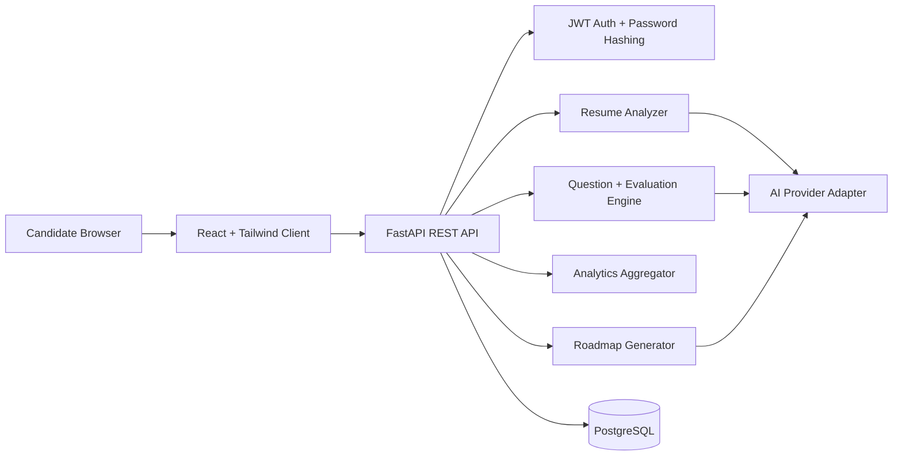

# InterviewIQ Architecture

## Backend Modules

- `routers`: REST endpoints grouped by authentication, resumes, interviews, dashboard, and roadmaps.
- `models`: SQLAlchemy models for users, resumes, interviews, questions, answers, evaluations, and roadmaps.
- `schemas`: Pydantic request and response contracts.
- `services`: Resume parsing and deterministic analysis helpers.
- `ai`: Prompt builders and provider adapter. The default `mock` provider returns structured JSON-like data so the application runs without API keys.

## API Surface

- `POST /api/auth/signup`
- `POST /api/auth/login`
- `GET /api/auth/me`
- `POST /api/resumes/upload`
- `GET /api/resumes`
- `POST /api/interviews/generate`
- `GET /api/interviews`
- `GET /api/interviews/{interview_id}`
- `POST /api/interviews/{interview_id}/questions/{question_id}/answer`
- `GET /api/dashboard`
- `POST /api/roadmaps/generate`
- `GET /api/roadmaps`

## Deployment Shape

- Frontend: Vercel, built from `client`.
- Backend: Render Docker service, built from `server`.
- Database: Managed PostgreSQL, injected through `DATABASE_URL`.
